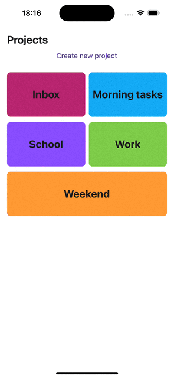

# Optimistic Updates with React Native

This repository brings some examples of how we can apply **Optimistic Updates** technique

In an optimistic update, the UI behaves like a change was successfully completed before receiving confirmation from the server that it was - it is optimistic that it will eventually get the confirmation rather than an error. This allows for a more responsive user experience.

## Table of Contents

- [Project Overview](#project-overview)
- [Installation](#installation)
- [Features](#features)
- [Technologies Used](#technologies-used)
- [Contributing](#contributing)

## Project Overview

In this repository we are using the Todoist API to manage tasks and projects as examples.
See: https://developer.todoist.com/rest/v2/#overview



## Installation

1. Clone the repository:

   ```bash
   git clone https://github.com/PHtorres/react-native-optimistic-updates-example
   ```

2. Install dependencies:

   ```bash
   yarn

   cd ios

   pod install
   ```

3. Configure environment variables:

   - Rename `.env.example` to `.env`.
   - Add Todoist api base url and auth token


4. Run the app on a simulator or device:

   - For iOS:

     ```bash
     yarn ios
     ```

   - For Android:

     ```bash
     yarn android
     ```


## Features

- Create projects
- Create tasks
- Delete tasks

## Technologies Used

- React Native v0.72
- TanStack's React Query v5
- React Navigation v7
- Axios

## Contributing

Contributions are welcome! If you find any issues or have suggestions for improvements, please open an issue or submit a pull request.
